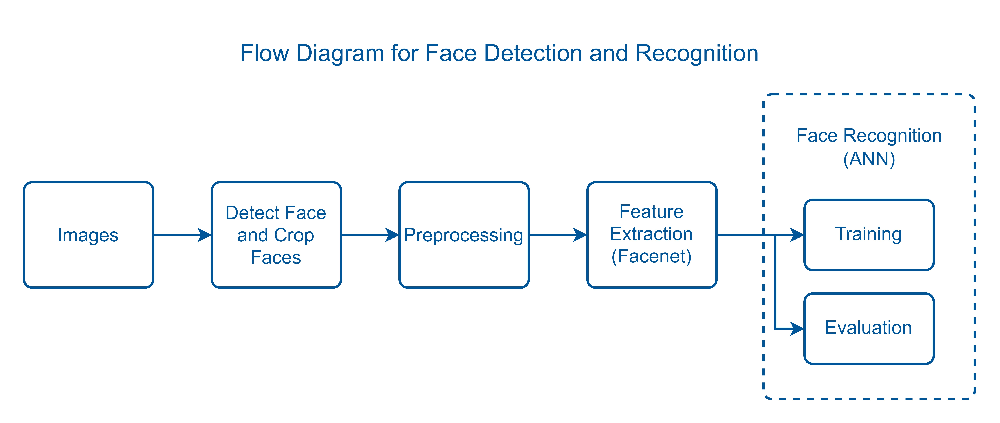

# ML-BI-Presence

## Introduction

ML-BI-Presence is a face recognition system designed to facilitate real-time attendance tracking and identity verification. Using a combination of Cascade Classifier for face detection, FaceNet for feature extraction, and an Artificial Neural Network (ANN) for classification, this system provides accurate and efficient face recognition capabilities.

## Meet The Machine Learning Team

| NIM        | Name                           | University                                         | Scope of Task                                                                                                                                                                                                                              |
| ---------- | ------------------------------ | -------------------------------------------------- | ------------------------------------------------------------------------------------------------------------------------------------------------------------------------------------------------------------------------------------------ |
| 2010511042 | Abednego Christianyoel Rumagit | Universitas Pembangunan Nasional "Veteran" Jakarta | Model Research, Dataset Collection, Data Processing, Deep Learning Model Development, Model Training, Testing & Optimization, Model Deployment, Real-Time Face Recognition API, Model Training API, ML-Frontend Integration, Documentation |
| 16119489   | Vicky Maulana                  | Universitas Gunadarma                              | Model Research, Creating Attendance Pages, Improve Real-Time Prediction using Camera, UI Integration with ML Models                                                                                                                        |

## Flow Diagram for Face Detection and Recognition

The following diagram illustrates the step-by-step process for face detection and recognition using MTCNN for detecting faces, FaceNet for extracting facial features, and an ANN for classifying the faces:



## Requirements

To run this project, you need the following Python packages with their specified versions:

- **tensorflow**: 2.10
- **numpy**: 1.24.3
- **Django**: 4.2.13
- **djangorestframework**: 3.15.2
- **opencv-python**: 4.10.0.84
- **mtcnn**: 0.1.1
- **keras-facenet**: 0.3.2
- **scikit-learn**: 1.3.2
- **pillow**: 10.4.0
- **drf-yasg**: 1.21.7
- **django-compressor**: 4.5.1
- **django-cors-headers**: 4.4.0
- **tensorflow-hub**: 0.16.1

## Installation

To set up the project locally, follow these steps:

1. **Clone the repository**:

   ```bash
   git clone https://github.com/BI-Presence/ML-BI-Presence.git
   cd ML-BI-Presence

   ```

2. **Create a virtual environment**:

   ```bash
   python -m venv my_env

   ```

3. **Activate the virtual environment**:

   ```bash
   my_env\Scripts\activate  # On MacOS: source my_env/bin/activate

   ```

4. **Install the required dependencies**:

   ```bash
   pip install -r requirements.txt

   ```

5. **Change directory to `model_deploy`**:

   ```bash
   cd model_deploy

   ```

6. **Apply migration**:

   ```bash
   python manage.py migrate

   ```

7. **Run the server**:

   ```bash
   python manage.py runserver

   ```

8. **Access the application:**  
   Open your web browser and go to [http://127.0.0.1:8000](http://127.0.0.1:8000)

## Usage

### (Make sure you have the Back End BI-Presence.client running before proceeding and update the API links in your views.py file.)

Here’s how to use the ML-BI-Presence application:

1. **Real-Time Detection**:
   - Access the live detection page to start the webcam and detect faces in real-time. The system will process the image and provide immediate feedback on detected faces.
2. **Training the Model**:
   - Use the /train-model endpoint to initiate training of the face recognition model with new data. The training process will run in a separate thread to avoid blocking the server.
3. **API Endpoints**:
   - /swagger: Access the Swagger UI documentation to view and test the API endpoints.
   - /prediction: Endpoint for face prediction with upload file.
   - /classify-face: Endpoint for real-time face recognition.
   - /train-model: Endpoint for training the model with new data. Make sure to update the links in your views.py file to match the correct folder paths on your laptop.

## Contact

For any questions or inquiries, please contact us at [abednegoefra31@gmail.com](mailto:abednegoefra31@gmail.com).

---

**Resources**:

- Cascade Classifier: [OpenCV Cascade Classifier](https://docs.opencv.org/3.4/db/d28/tutorial_cascade_classifier.html)
- MTCNN: [MTCNN Face Detection](https://pypi.org/project/mtcnn/), [MTCNN Github](https://github.com/ipazc/mtcnn)
- FaceNet: [Keras FaceNet](https://pypi.org/project/keras-facenet/), [Facenet Github](https://github.com/davidsandberg/facenet)
- ANN: [Artificial Neural Network Overview](https://www.ibm.com/topics/neural-networks)
- Django: [Django Documentation](https://docs.djangoproject.com/en/5.0/)
- Deploying a Machine Learning Model Using Django: [Medium Article](https://medium.com/saarthi-ai/deploying-a-machine-learning-model-using-django-part-1-6c7de05c8d7)
- Example Video on Implementing Django: [YouTube Video](https://www.youtube.com/watch?v=rNhVBv0i4os)
